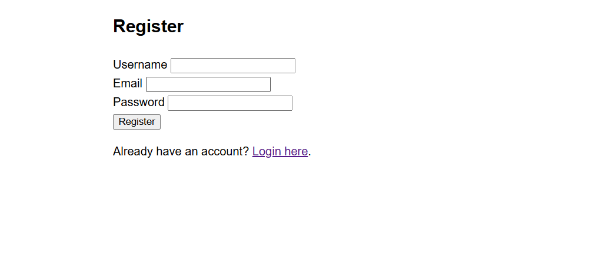

# Flask Blog - Phiên bản 1.0.0

**Ngày phát hành:** 28/02/2025

## Tính năng mới
- Khởi tạo dự án Flask blog
- Tạo cấu trúc thư mục cơ bản
- Thiết lập các route cơ bản: trang chủ, đăng nhập, đăng ký, xem bài viết
- Tạo models ban đầu: User và Post

## Screenshots

