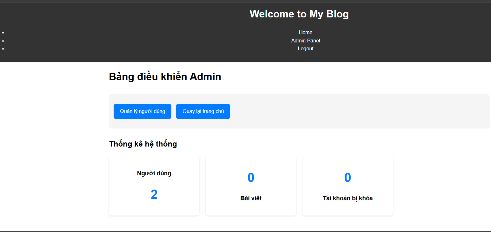
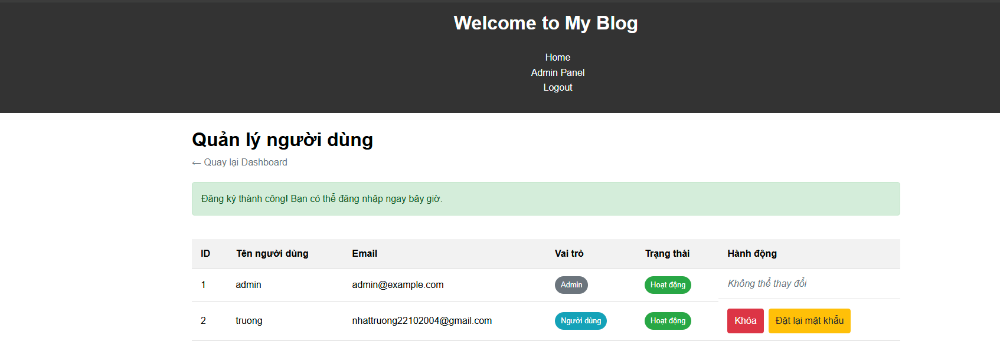

# Flask Blog - Phiên bản 3.0.0

**Ngày phát hành:** 15/03/2025

## Tính năng mới
- **Bảng điều khiển Admin**: Thêm trang quản lý dành riêng cho admin
- **Quản lý người dùng**: Admin có thể xem danh sách tất cả người dùng
- **Khóa tài khoản**: Admin có thể khóa và mở khóa tài khoản người dùng
- **Đặt lại mật khẩu**: Admin có thể đặt lại mật khẩu cho người dùng
- **Thông báo khóa tài khoản**: Hiển thị thông báo khi người dùng bị khóa cố gắng đăng nhập

## Cải tiến kỹ thuật
- Thêm trường `is_admin` và `is_blocked` vào model User
- Thêm middleware kiểm tra trạng thái khóa của người dùng
- Tích hợp Flask-Login để quản lý phiên đăng nhập
- Tạo tài khoản admin mặc định khi khởi tạo ứng dụng

## Screenshots

## Hướng dẫn sử dụng
1. Đăng nhập với tài khoản admin mặc định:
   - Username: admin
   - Password: admin123
2. Truy cập vào đường dẫn /admin để mở bảng điều khiển
3. Chọn "Quản lý người dùng" để xem và quản lý danh sách người dùng