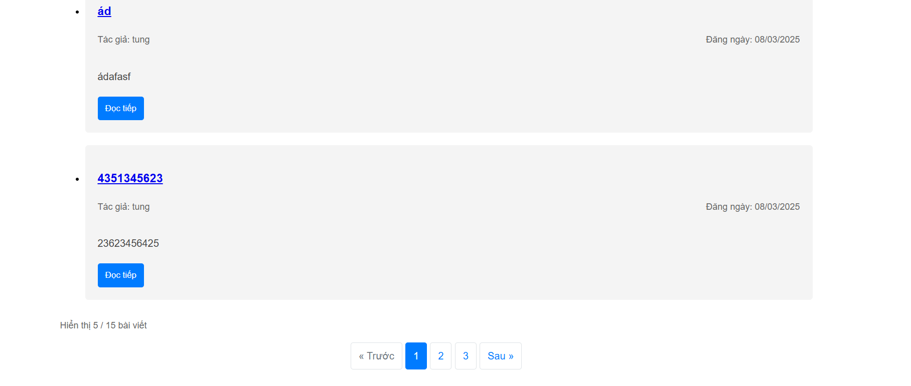

# Flask Blog - Phiên bản 5.0.0

**Ngày phát hành:** 10/05/2025

## Tính năng mới
- **Phân trang (Pagination)**: Hiển thị 5 bài viết trên mỗi trang
- **Điều hướng phân trang**: Buttons để di chuyển giữa các trang
- **Hiển thị thông tin phân trang**: Số bài viết đang hiển thị và tổng số bài viết

## Cải tiến kỹ thuật
- Sử dụng hàm `paginate()` của SQLAlchemy để xử lý phân trang hiệu quả
- Tối ưu hiệu suất khi hiển thị lượng dữ liệu lớn
- Cải thiện trải nghiệm người dùng khi duyệt qua nhiều bài viết

## Screenshots

## Hướng dẫn sử dụng
1. Điều hướng qua các trang sử dụng các nút "Trước" và "Sau"
2. Nhấp vào số trang cụ thể để chuyển đến trang đó
3. Thông tin phân trang hiển thị số lượng bài viết đang được hiển thị và tổng số bài viết
4. Mặc định mỗi trang hiển thị tối đa 5 bài viết